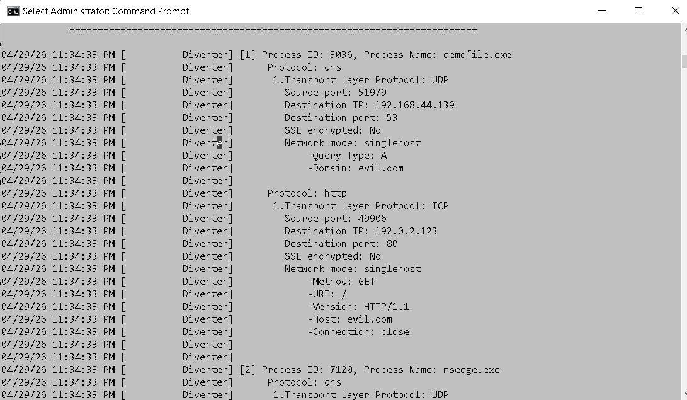

1) **Start FakeNet**
   ```
   fakenet.exe
   ```
2) **Run your Suspicious Executable**
   You can compile and use th the demofile.c in this module.
   ```
   demofile.exe
   ```
3) **Check the FakeNet Results**
   Look for the file that you executed to see what domain or IP is associated with those results.

   

